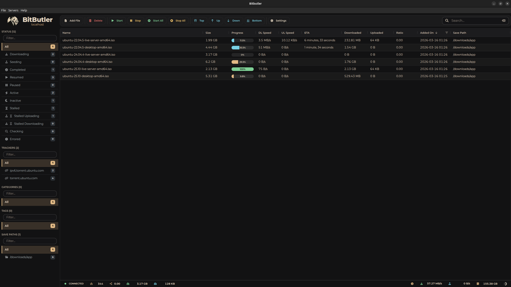
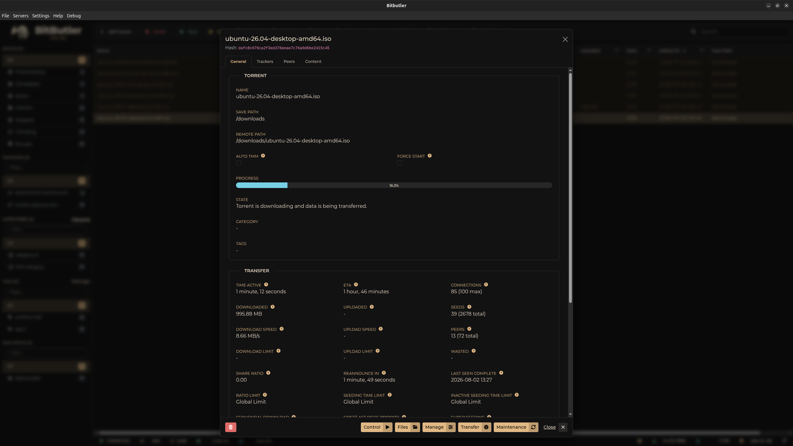
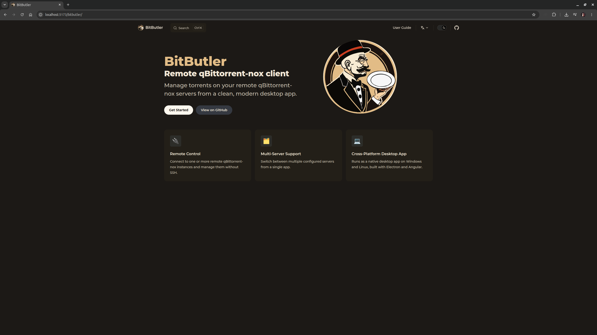

<p align="center">

</p>

<div align="center">

# BitButler

_The digital butler for your torrents._

[](https://github.com/enisz/bitbutler/releases/latest)
[](https://github.com/enisz/bitbutler/actions)
[](https://github.com/enisz/bitbutler/releases)
[](https://github.com/enisz/bitbutler/blob/main/LICENSE)

### A clean, simple, and modern way to manage your qBittorrent-nox servers.

</div>



BitButler is a desktop remote client specifically designed to connect to and manage **qBittorrent-nox** instances. Instead of dealing with clunky web interfaces or browser tabs, BitButler gives you a dedicated, professional space to keep your downloads organized.



It’s fast, it’s modern, and it works where you do.

## Compatibility

**Important note**: currently the app supports the qBittorrent v4.1.0 - v4.6.x releases. Support for the latest API 5.x is coming soon.

Using with newer versions of the API may be possible, but can be buggy as there were some breaking changes.

## Table of Contents

<!-- toc -->

- [The Story Behind BitButler](#the-story-behind-bitbutler)
- [Why use BitButler?](#why-use-bitbutler)
- [Tech Stack](#tech-stack)
- [Localization](#localization)
  - [Help the Butler Learn!](#help-the-butler-learn)
- [Quick Start](#quick-start)
- [User Guide](#user-guide)
- [For the Developers](#for-the-developers)
  - [Prerequisites](#prerequisites)
  - [Setup](#setup)
  - [Building the App](#building-the-app)
- [Community & Support](#community--support)

<!-- tocstop -->

## The Story Behind BitButler

BitButler is a hobby project born out of personal necessity. For years, I used Transmission paired with "Transmission Remote GUI" desktop client. When I eventually made the switch to qBittorrent, I really missed having a snappy, dedicated desktop application to manage my remote server.

I built BitButler to fill that gap: to give qBittorrent-nox users a fast, native-feeling desktop client that doesn't rely on keeping a web UI open in a browser tab.

## Why use BitButler?

- **Clean & Modern:** A fresh interface built for the modern desktop.
- **Fast Management:** Quickly sort through hundreds of torrents, filter by state, and manage your queue without the lag.
- **Always Ready:** As a standalone app, it’s always just an `Alt+Tab` away.
- **Safe & Private:** Your server credentials and data stay on your machine. BitButler talks directly to your server and keeps things secure.
- **Multi-language Support:** Use the app in your native tongue (currently supporting English and Hungarian).

## Tech Stack

| Tool           | Purpose            | Badge                                                                                                                  |
| :------------- | :----------------- | :--------------------------------------------------------------------------------------------------------------------- |
| **Angular**    | Frontend Framework |          |
| **Electron**   | Desktop Shell      |       |
| **SQLite**     | Local Database     |             |
| **ag-Grid**    | Data Management    |   |
| **TypeScript** | Logic & Types      |  |

## Localization

BitButler speaks multiple languages! Currently:

- 🇺🇸 **English** (`us.json`)
- 🇭🇺 **Hungarian** (`hu.json`)

### Help the Butler Learn!

Want to see BitButler in your language? We make it easy to contribute. Language files are located in `packages/app/public/i18n/`. You can simply copy `us.json` to a new file and translate the values.

Check our [Contributing Guide](.github/CONTRIBUTING.md) for more details on how to submit a new language.

## Quick Start

1.  **Download & Install:** Grab the [latest version](https://github.com/enisz/bitbutler/releases/latest) from the Releases page. You can find multiple formats depending on your preference:
    - **Windows:** Setup (`.exe`), Portable (`.exe`), or Archive (`.zip`)
    - **Linux:** AppImage, `.deb`, `.rpm`, `.snap`, or `.tar.gz`
2.  **Connect:** Enter your qBittorrent-nox server's IP address and credentials.
3.  **Manage:** Start organizing your torrents immediately.

Note: On Windows, you may see a "Windows protected your PC" warning. This is because the app is not signed with an expensive developer certificate. You can click "More info" and then "Run anyway" to start the Butler.

## User Guide



Want the full walkthrough? The [User Guide](https://enisz.github.io/bitbutler/) covers installation, connecting servers, managing torrents, settings, and troubleshooting - available in English and Hungarian.

## For the Developers

If you're a developer and want to play with the code or build a custom version:

### Prerequisites

- **Node.js** (v20 or higher)
- **npm**
- _(Linux Only)_: `rpm` tools installed (`sudo apt-get install rpm`) to build the `.rpm` package.

### Setup

```bash
# Clone the repo
git clone https://github.com/enisz/bitbutler.git

# Install dependencies
npm install

# Run in development mode
npm start

```

### Building the App

Our build scripts automatically compile the Angular UI and package the Electron app into multiple distribution formats.

```bash
# Windows (Builds NSIS Installer, Portable, and ZIP)
npm run dist:win

# Linux (Builds AppImage, DEB, RPM, Snap, and Tarball)
npm run dist:linux

```

## Community & Support

BitButler is an open-source project. If you have an idea for a feature or found something that isn't working quite right, feel free to open an issue or submit a pull request. I would love to hear how people use the "Butler."

_Built with ❤️ for the community._
